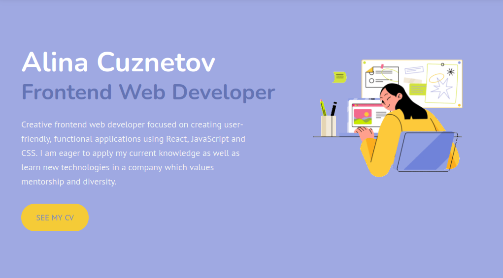

# Alina in Codeland

Welcome to my first personal website. The website contains an overview of my career objectives, skills, projects and contact information. I'm looking forward to hearing from you! 

---
 

## Live demo 

[Click me!](https://alina-in-codeland.netlify.app/#home)

---
 

## Installation instructions

- clone repository
- npm install
- npm start

--- 

 

## Tech stack 

- React JS 
- CSS / SCSS
- MDBoostrap
- Emailjs/browser 

---

  

## Credits 

- Illustration by <a href="https://icons8.com/illustrations/author/mNCLibjicqSz">Julia K</a> from <a href="https://icons8.com/illustrations">Ouch!</a>
- Illustration by <a href="https://icons8.com/illustrations/author/JTmm71Rqvb2T">Dani Grapevine</a> from <a href="https://icons8.com/illustrations">Ouch!</a>

---